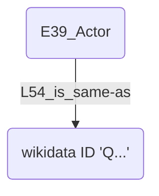
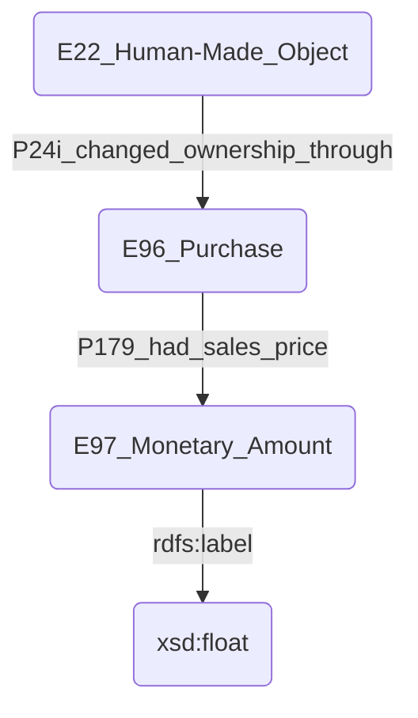
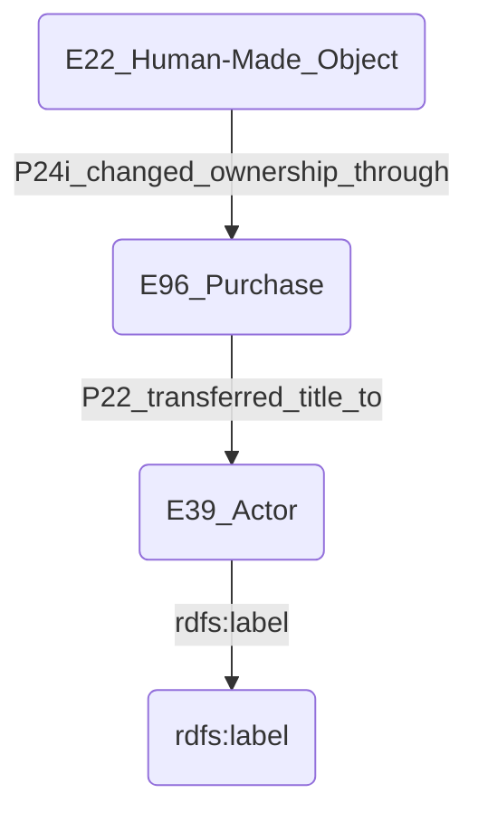
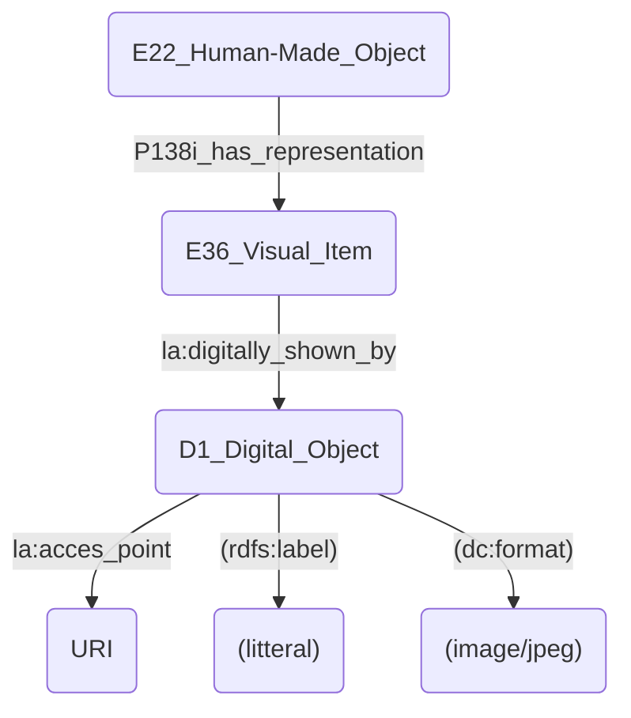

# Points à améliorer
## Personage
#### Wikidata ID
Les données sur les wikidata id des personages ne sont disponibles que dans une view (**basart_artists.csv***) mais pas dans la table originale **personage.csv**. Il serait intéressant de les intégrer aux entrées des personnages comme ceci:

## Works
###### Room
Un des champ de la table de données concernant les œuvres concerne la **room**, qui désigne certainement la salle dans laquelle une œuvre a été placée lors d'une exposition donnée.
Je n'ai pas su comment intégrer cette donnée selon le modèle CIDOC-CRM et l'ai donc laissée de côté pour l'instant.

###### Price
Un des champ concerne le prix des œuvres. Malheureusement, il manque de contexte. On ne connaît pas la currency, ni l'époque à laquelle ce prix a été fixé. Dans la représentation de la modélisation, j'ai proposé de pouvoir l'utiliser comme ceci:

Malheureusement, il semble difficile d'utiliser ce modèle sans connaître plus à fond l'acte de vente relatif.

###### Owner
Un des champ concerne le propriétaire des œuvres. Comme pour le prix, cette information manque de contexte. On pourrait l'utiliser comme ceci, si l'on est à même de trouver plus d'informations sur l'acte de vente.

###### Notes
Un des champ intègre des notes, des commentaires très variables. l'information est trop complexe pour être insérée dans une entité CIDOC-CRM précise.

###### Catalog chapter
Ce champ semble préciser le chapitre du catalogue d'où est tirée l'info. Je n'ai pas su comment l'intégrer à une catégorie CIDOC-CRM.

###### Size
Le champ size contient toutes les informations relatives aux dimensions des œuvres, dans des formats variables (la plupart présentent 2 dimensions séparés par un "x" ou par " x "). Certaines spécifient également l'unité de mesure employée, mais beaucoup d'autres non.
Il faudrait vérifier le contenu de chacune de ces entrées et séparer les diverses dimensions en plusieurs entrées pour pouvoir modéliser avec précisions ces informations.
Dans l'état actuel, le contenu brut du champ est reporté dans une entité E54_Dimension.

###### Has representation
Si une œuvre donnée a une représentation dans le catalogue dont sont issues les informations la concernant, elle a normalement le E55_type "basart:work_image_in_catalog". Il faudrait maintenant y ajouter un lien linkedArt vers l'image digitalisée, suivant ce schéma:

## Address
###### Validity end year
Ce champ renseigne sur la fin de la validité de l'adresse. Je n'ai pas su l'intégrer à une catégorie CIDOC-CRM. (En ce qui concerne le champ validity_begin_year, je n'ai même pas cherché à l'intégrer car il est systématiquement vide dans notre base de données)

###### Source Geoloc
Ce champ doit renseigner sur la source utilisée pour trouver la géolocalisation de l'adresse. Je n'ai pas su comment l'intégrer à une catégorie CIDOC-CRM.

## Cities
###### Wd_identifier
Ce champ a été mappé pour être lié à l'instance de la ville avec un crmdig:L54_is_same-as, malheureusement il est vide dans notre base de données.

###### Source Geoloc
Ce champ doit renseigner sur la source utilisée pour trouver la géolocalisation de l'adresse. Je n'ai pas su comment l'intégrer à une catégorie CIDOC-CRM.

## Country / Nation
###### ISO code
Ce champ indique le code ISO du pays en 2 lettres. Je n'ai pas su comment l'intégrer à une catégorie CIDOC-CRM.

###### Source Geoloc
Ce champ doit renseigner sur la source utilisée pour trouver la géolocalisation de l'adresse. Je n'ai pas su comment l'intégrer à une catégorie CIDOC-CRM.

## Articles
###### Comments
Ce champ contient des commentaires de natures très variées. Je n'ai pas su comment l'intégrer à une catégorie CIDOC-CRM.

## Section
###### Address
Toutes les entrées ont un **id_address**, correspondant à une adresse existante dans la table address. Mais certaines entrées contiennent également un champ supplémentaire **adresse**.
Par exemple l'exhibition section `id 80`, avec l'id_address `16525` correspondant à l'adresse `Av. Pedro Álvares Cabral`, présente le supplément address `Parque Ibirapuera`.
La seule façon que je voie pour ajouter ce complément est de lier l'entité **section** à 2 entités **address**, l'une correspondant à l'id_address, et l'autre correspondant à ce complément.
Il serait mieux de créer une seule entité **address** qui combine les deux éléments, mais c'est assez compliqué, car les adresses données dans la table **address** sont déjà une combinaison de 5 champs différents, pouvant exister ou non. Afin de les combiner correctement, sans ajouter de virgule excédentaire, j'ai dû prendre en compte toutes les 32 combinaisons possibles de ces champs. Il faudrait donc passer le contenu de ces cinq champs dans la table **exhibition_section** pour chaque entrée ayant un contenu dans son champ **address**, puis recréer ces 32 combinaisons possibles en y ajoutant le contenu du champ **address** complémentaire. Je n'ai pas eu le temps de réaliser tout cela.

###### Space type
Le space est rattaché à l'entité **E53_Place** tirée de l'**adresse** (id_address). Je ne sais pas si cela est la meilleure solution, mais je ne voit pas où il conviendrait mieux de rattacher cet élément.
J'ai hésité à le rattacher directement à l'entité **E7_Activity** reflétant l'exhibition section.

## Committee
###### Names
Ce champ mélange des noms de comités et des noms de personnes, participant audit comité.
Il faudrait nettoyer ces données pour pouvoir indiquer clairement quelle personne fait partie de quel comité.
Pour l'instant, le modèle se contente de témoigner de l'existence de comités et d'indiquer le contenu brut de ce champ en tant qu'appellation du comité.