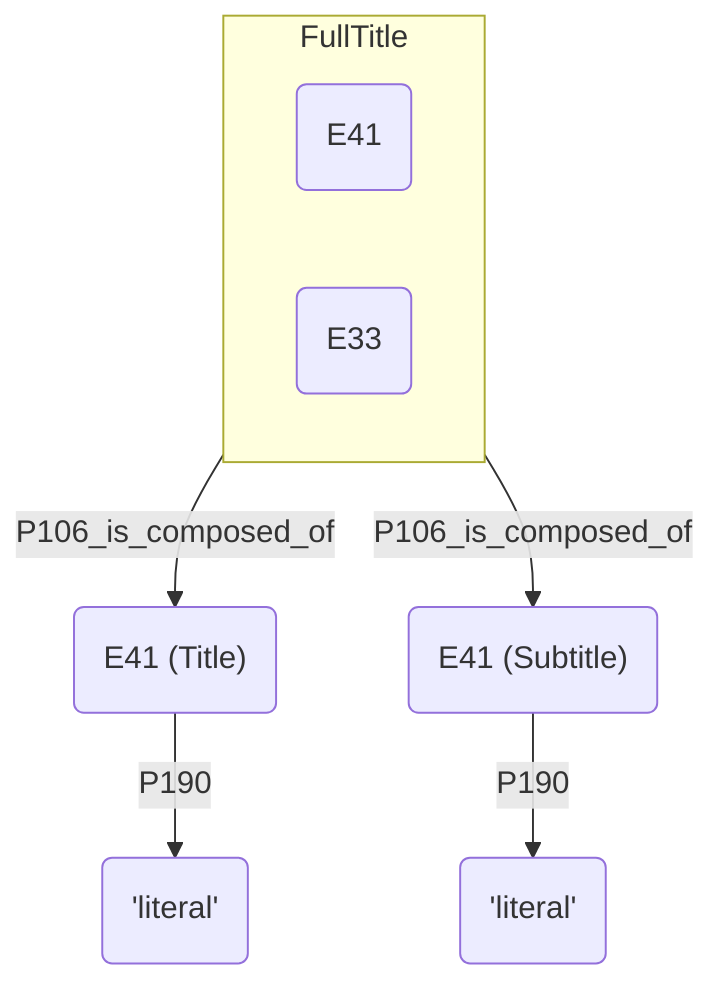
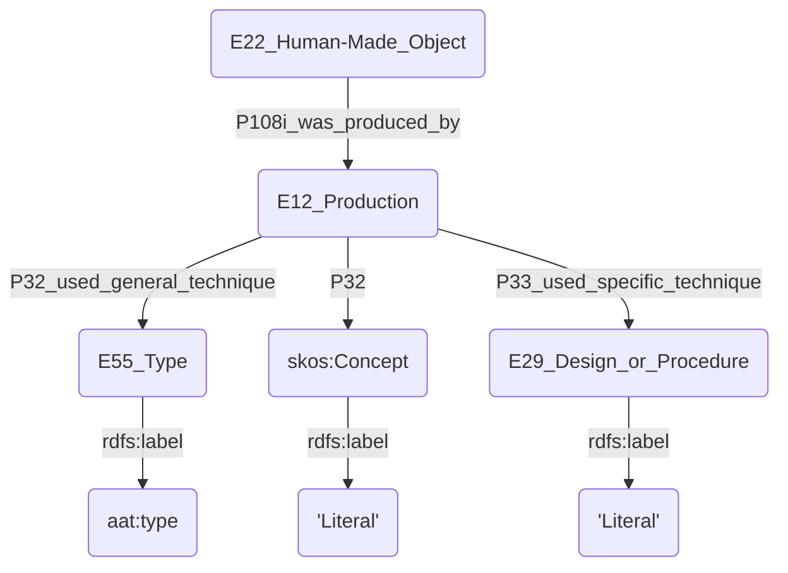
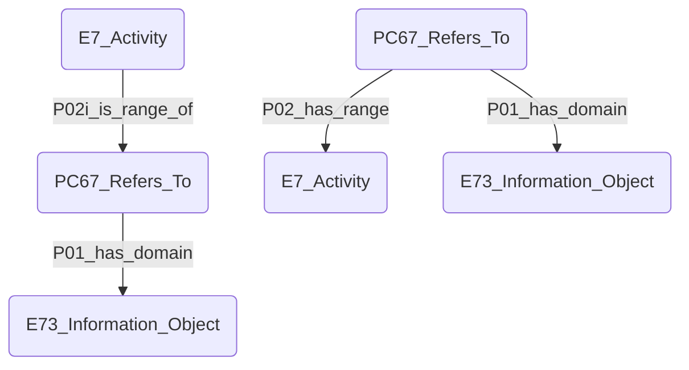
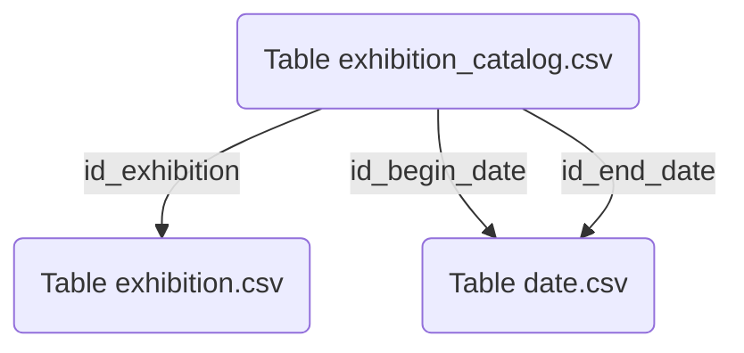
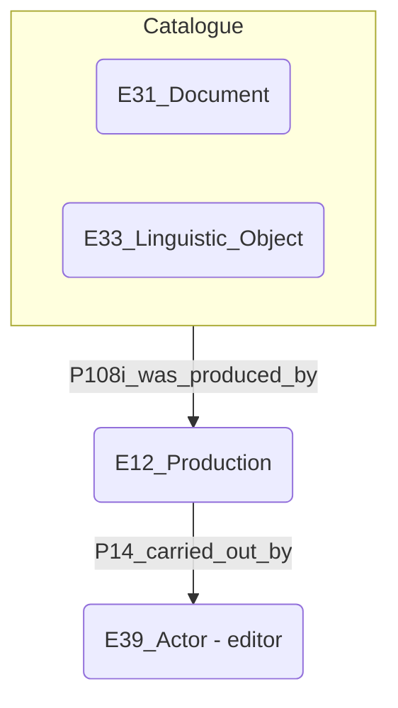
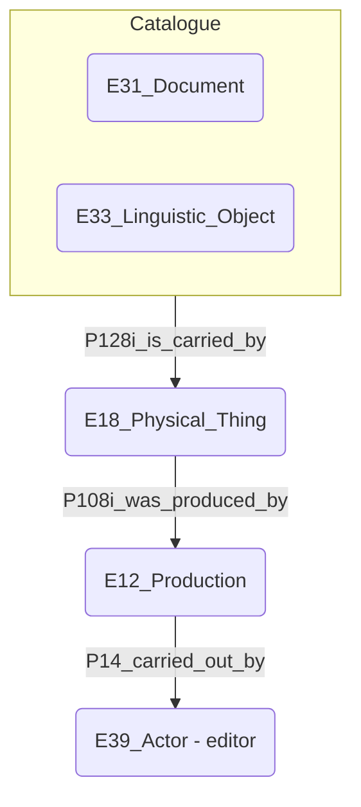
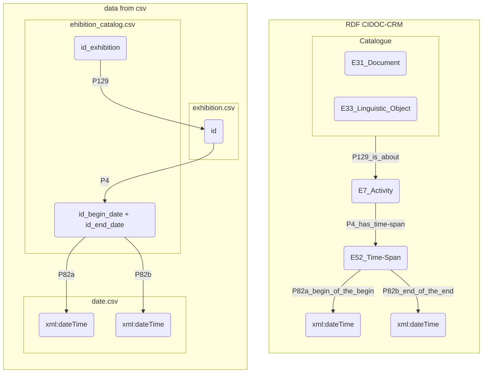
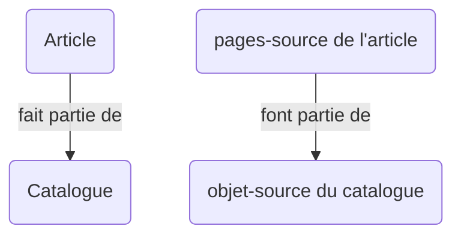
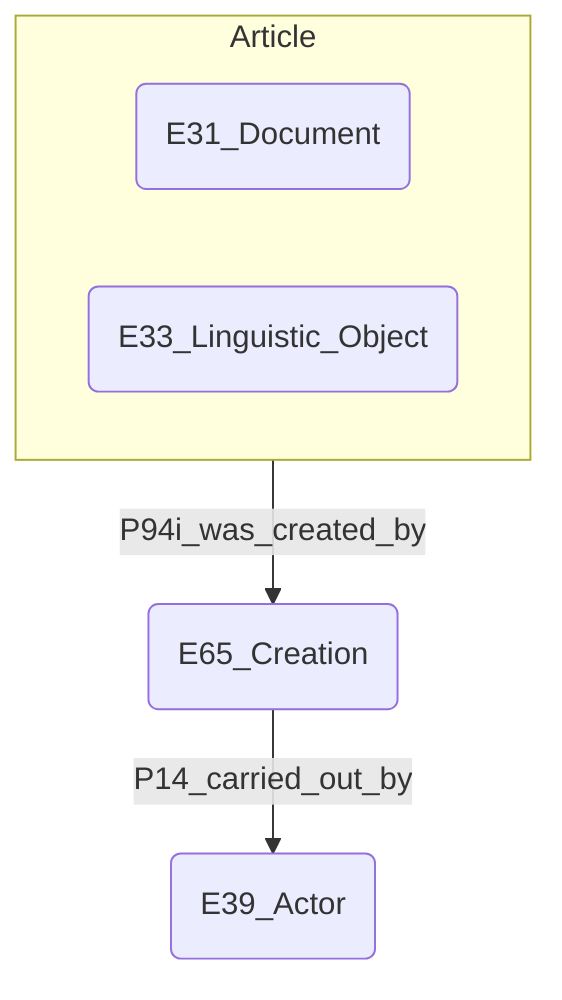
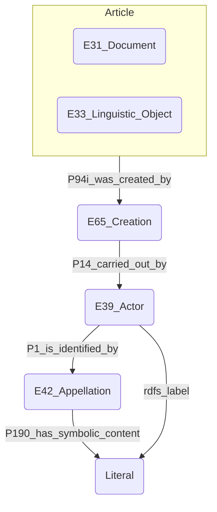

# Mapping – XML to RDF with 3M
## Généralités
### Quels fichiers
Pour chacune des tables suivantes: 
- **adress + city + nation**
- **catalog + catalog_language**
- **articles**
- **catalog_has_committee**
- **committee**
- **exhibition_group** + **exhibition_group_type**
- **exhibition_section**
- **personage**
- **work**
j'ai choisi de créer un policy qui leur est propre `policy_xxx.xml` ainsi qu'un mapping `mapping_xxx.x3ml` 

### 3M et la propriété crm:P190_has_symbolic_content
La propriété **P190_has_symbolic_content** n'est pas supportée par la version par défaut de 3M. Il faut l'intégrer directement dans le x3ml du mapping.
Pour pouvoir tout de même utiliser 3M et ne pas devoir faire ces modifications répétitives à la main, j'ai créé un script python `schemaToP190.py` qui transforme tout seul relations `rdfs_schema` si celles-ci sont suivies d'un commentaire de type `rationale` débutant par `P190`.
Son utilisation demande uniquement d'entrer le bon nom de ficher en lecture dans la variable `rfile` et un nom adéquat pour le nouveau fichier ainsi créé en sortie dans la variable `wfile`.

### Generate xml from csv
Begin_year est un champ toujours présent. Sa conversion en xml ne pose pas de problème, il garde le type `int`. End_year, par contre, a parfois des informations manquantes. La librairie pandas a donc tendance à le convertir en `float`. Pour éviter cela, j'ai dû ajouter une ligne de code au script python : `df["end_year"] = df["end_year"].astype('Int64')`.

## Personage
### Nom complet
Pour le nom de famille, comme pour le prénom, on peut facilement mettre un **IF RULE exists(text())**. Mais c'est plus compliqué de faire un bon IF RULE pour le nom complet.
S'il y a prénom + nom, on veut le format `{prénom} {nom}`
S'il n'y en a qu'un des deux, on voudrait éviter d'insérer l'espace pour obtenir uniquement `{nom}` ou `{prénom}`.
Certaines entrées n'ont ni l'un ni l'autre, ce sont celles avec les ids: **35151**, **34798**, **35116**, **35709**. Je ne sais pas ce que l'on souhaiterait faire avec ces entrées.

### Instructor
L'idéal serait d'avoir un id pour chaque instructor, que l'on pourrait référencer de la même manière que les autres personages.
Malheureusement les data ne nous donnent qu'un nom, un littéral.
La policy contient donc des generators `unknown_person` permettant de leur créer un ID basé sur un hash de leur nom.
De cette manière, ces instructors sont représentés de la même manière que les autres personnages des tables basart, même si les données les concernant sont moins complètes.

## Address
### Appellations - Label
Les labels sont composés de certains des éléments suivant: `road_number`, `road`, `floor`, `locality`, `complement`. Afin de ne pas insérer de virgules ou d'espaces superflus, chaque combinaison est prise en compte dans divers generators de la policy et par les `if_conditions` du mapping.

## Exhibited works
### Type
J'ai choisi de donner le constant aat type [works of art (300133025)](http://vocab.getty.edu/aat/300133025) aux œuvres, plutôt que le type [visual works (works) (300191086)](http://vocab.getty.edu/aat/300191086), car il est plus large et pourra donc convenir à d'autres types d'œuvres, au besoin.

### Titles
Les titres sont mappés selon la relation suivante


Pour la production des œuvres, cidoc-crm ne permet pas l'utilisation d'un littéral après P33_used_specific_technique. Il faut utiliser une des trois relations suivantes:


## Medium et Category
Ces champs problématiques ont nécessité un grand nettoyage des données. Pour ce faire, j'ai procédé à une clusterization des données sur OpenRefine. Les entrées de ces champs sont trop nombreuses, entre autres car une même technique ou un même type d'œuvre peut être référencé sous diverses appellation, à cause d'écart dans la façon de rédiger ce nom, ou car il figure dans plusieurs langues différentes. Afin d'harmoniser ces appellations, je me suis référé au vocabulaire contrôlé de Getty AAT.

### Medium
Le champ **medium** fait référence à la technique employée par l'artiste pour créer l'œuvre. Afin de sélectionner le bon terme du vocabulaire AAT pour la désigner, j'ai privilégié les termes retenus dans la catégorie **Activities Facet (Processes and Techniques)** à chaque fois que cela était possible.
Les modifications ont été recensées dans le document **AAT_medium.csv**. Les cas les plus problématiques sont également mentionnés à la page [[Tables CSV#Medium|Tables CSV]].

### Category
Le champ **category** fait référence au type de l'œuvre produite, le résultat fini. Afin de Afin de sélectionner le bon terme du vocabulaire AAT pour la désigner, j'ai privilégié les termes retenus dans la catégorie **Object Facet** à chaque fois que cela était possible.
Les modifications ont été recensées dans le document **AAT_category.csv**.

## Exhibition
### Source
La table Exhibition.csv est centrée sur les expositions. Partant de ces données, on peut facilement modéliser sa source sur 3M comme le modèle de gauche, mais il me paraît beaucoup plus compliqué de suivre le modèle de droite.

Peut-être faudrait-il créer un nouveau mapping centré sur ces PC67_Refers_To (désignés comme éléments principaux), mais il deviendrait difficile de conserver des URI selon le modèle `basart:exhibition/{id}/source_link` qui me semble être le plus adapté pour ce genre d'information.

### Date
Les dates présentes dans la table exhibition ne contiennent que l'année. Il est mieux de passer l'intermédiaire des tables `exhibition_catalog.csv` et `date.csv` pour gagner en précision:

Les dates dans la table **date.csv** contiennent également le mois et le jour, et sont donc plus précises que celles inscrites dans les champs begin_date et end_date de la table exhibition.csv.

## Exhibition catalog
### Language
Le champ language de la base de données contient des literals aux formes variées, dont certains présentent en fait plusieurs langues. Il a fallu séparer ces entrées en plusieurs entrées différentes et les clusturiser pour aboutir à un résultat satisfaisant.
Dans un second temps, il serait également intéressant de lier ces langues aux entités AAT correspondantes.

### Editor
Parfois, l'editor a un id (champ **id_editor**), qui correspond a une entrée dans la table personage.csv. Parfois il ne contient qu'un nom (champ **editor**) et n'est pas présent dans la table personage.csv.
Dans le premier cas il est facile de mapper un lien vers person/{id}, et il ne faut pas tenir compte des données dans le champ editor, car elles font doublons avec les données déjà mappées depuis la table personage.csv.
Dans le deuxième cas, il a fallu utiliser les generators `unknown_person` mentionnés plus haut pour générer des URI à ces personages.

Il y a peut-être une confusion en editor et publisher. Au vu des données, j'ai interprété les informations sur l'éditeur (les champs editor et id_editor) comme étant relative à l'acteur en charge de la production physique du catalogue en tant qu'objet physique.
S'il s'agit effectivement de l'acteur en charge de la production physique du catalogue, CIDOC-CRM n'admet pas qu'on le modélise comme ceci :

Le problème est que E31 est un objet **conceptuel** et que E12 s'applique aux objets **physiques**.
Il faut donc le modéliser comme ceci :

Mais ce chemin très lourd complique l'exploration des données.

### Date
les champs **id_begin_date** et **id_end_date** font référence aux dates précises de l'**exhibition**, mais pas du catalogue. La date du catalogue est donnée dans le champ **publishing_year**. Il ne s'agit que d'une année, et non pas d'un id correspondant à une date de la table **date.csv**.
Comme les dates indiquées par ces 2 champs **id_begin_date** et **id_end_date** dans la table **exhibition_catalogue.csv** sont plus précises que celles dans la table **exhibition.csv**, on peut les utiliser pour générer le time-span des expositions comme ceci:


## Date
Créer des URI indépendant pour les time-span `basart:time/{time-span_id}` ne fait pas tellement de sens. Chaque time-span est composé de 2 dates, il faudrait donc un URI indépendant pour chaque combinaison de 2 dates. Il serait donc plus logique de relier l'URI des time-span à l'event auquel ils sont liés `basart:person/{person_id}/birth/time-span`.

## Catalog article
### Language
Comme pour les entités représentant les catalogues, le champ de la langue des articles n'affiche qu'un littéral. Il faudrait donc le traiter de la même manière, soit séparer les entrées présentant plusieurs langues en différentes entrées, puis les clusturiser. Je j'ai malheureusement pas eu le temps de réaliser cela.
Dans un second temps, il serait également possible de faire en sorte que la langue redirige vers un getty/aat type plutôt que vers un literal

### pages (catalog pages)
Le champ **pages** de la table **catalog_article.csv** indique les pages où se trouvent l'article, au sein du catalogue. On peut donc le considérer comme la "source" de l'article (de la même manière que les catalogues ont comme "source" le catalogue papier ou numérique, donc l'objet physique portant le contenu conceptuel). En tant que telle, on peut donc considérer qu'elle fait partie d'une source plus grande, à savoir l'objet-source du catalogue.


### Authors
S'il y a un author_id il suffit d'ignorer le champ **author** de la table **catalog_article.csv** et de ne se baser que sur le champs **author_id**.


S'il n'y a pas d'id, il faut récupérer le literal présent dans le champ **author**, et lui créer un ID avec les generators `unknown_person` en suivant le modèle conceptuel :


## Exhibition section
### Space and title
Il est difficile de bien saisir "où" situer l'élément **space** de la table **exhibition_section.csv**. J'hésitais entre l'incorporer à **l'appellation** de la section (le combiner avec le champ **title**) ou l'incorporer à **l'adresse** de la section (le combiner avec le champ **id_address**).
Exemple avec la section id 3462:
title|space|address|city
-|-|-|-
Section Allemande - Peinture|Musée des Arts Décoratifs|107, Rue de Rivoli|Paris
En langage naturel, cela devrait donner:
```
Section Allemande - Peinture
Musée des Arts Décoratifs
107, Rue de Rivoli
Paris
```
J'ai choisi de l'intégrer à l'appellation plutôt qu'à l'adresse, car dans nos données en csv, l'appellation est un literal, tandis que l'adresse est sous forme d'un id renvoyant à une autre table. Il est donc beaucoup plus simple de l'incorporer à l'appellation.
En fonction des champs présents pour chaque entrée, l'appellation prend donc une de ces forme: `{title}, {space}`, `{title}` ou `{space}`.
