# Modélisation RDF
## Choix
Dans la modélisation sur draw.io, les contenus entre guillemets "" indiquent des chaînes de caractères. Les mots dont la police est en vert indiquent qu'il s'agit d'un exemple de chaîne de caractère. Les mots dont la police est en rouge indiquent qu'il faut vérifier cette partie du modèle ou y opérer un choix.

## Time-span
Les time-span comprennent 2 xml:dateTime -> bcp sont uniques. Est-ce que ça fait sens de leur créer une entité pour chacun?
Pour l'instant, le modèle conceptuel propose de créer une entité E52_Time-Span pour chaque time-span, en les subordonnant aux événements qui les concernent, par exemple: `basart:person/birth/time-span`.

## Général
Globalement, vaut-il mieux intégrer à nos modèles uniquqment les informations qui seront utiles aux utilisateur·trice·s ainsi qu'aux analyses ? Par exemple, y a-t-il besoin de créer un E55_Type pour chaque ID de chaque élément ? Si un élément a différents P1 -> E41/E42, alors peut-être que pour le E41 principal, ça vaut la peine de mettre un P2 -> E55.
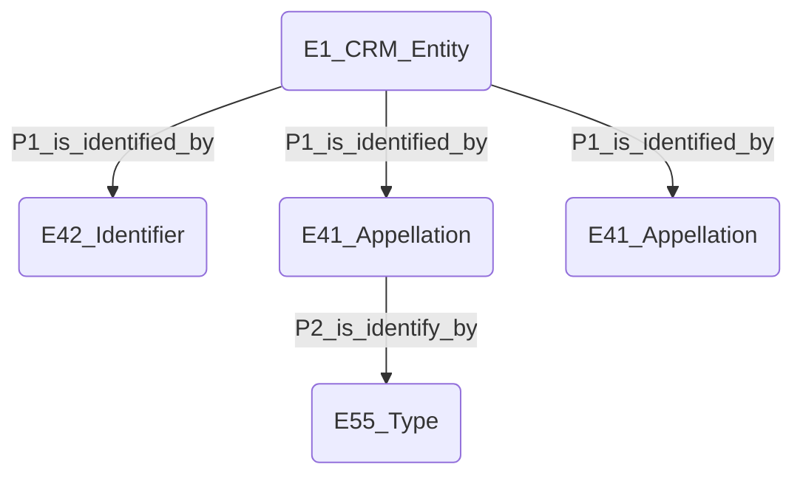

Les "top nodes" doivent avoir un lien `rdfs:label` vers un litteral, tandis que leurs entités d'appellations (E41, E42) doivent présenter des liens P190_has_symbolic_content menant au même littéral:
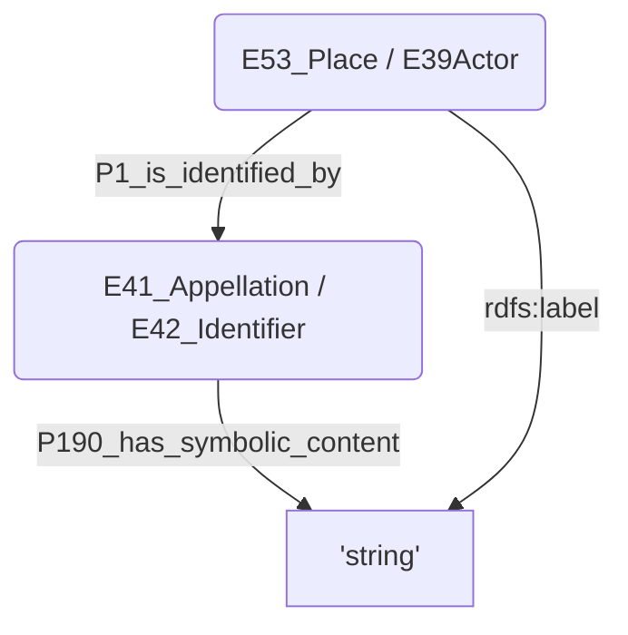

## Address
Pour les adresses, Le modèle retient 3 top nodes: 
- Adresse
- City
- Country

De les tables address.csv et city.csv, 3 champs n'ont pas été retenus dans ma modélisation:
- notes
- statefr
- staten
Peut-être qu'il conviendrait d'incorporer statefr ou stateen dans le triplet "City" ?

Pour les "villes", bien que Getty spécifie que son identifiant "city" est à distinguer de "village", "town", etc, on va utiliser celui-là, autant pour Paris que pour Meudon. Le type "inhabited places" serait plus juste du point de vue de Getty, mais pour l'utilisateur, c'est plus simple de comprendre si l'on parle de "city". L'adresse prend place dans une ville, qu'on peut aisément imaginer être un village, une commune ou autre. C'est moins intuitif de se dire que l'adresse se tient dans un "lieu habité".

Il est difficile de savoir quel est le meilleur terme à utiliser entre country et nation (pays et nation). Linked.art propose d'utiliser "**nations** (sovereign states)" ([http://vocab.getty.edu/page/aat/300128207](http://vocab.getty.edu/page/aat/300128207 "http://vocab.getty.edu/page/aat/300128207")) plutôt que "**countries** (sovereign states)" ([http://vocab.getty.edu/page/aat/300387506](http://vocab.getty.edu/page/aat/300387506 "http://vocab.getty.edu/page/aat/300387506")). La principale différence entre les deux est expliquée par un exemple donné dans une note de getty : "For example, England, Scotland, and Northern Ireland are countries in the nation of the United Kingdom." Je ne sais pas exactement quelle est la nature des données que nous avons dans la base de données, mais il me semble que le terme "nation" soit plus approprié.

Deux champs désignent le pays, l'un en français l'autre en anglais. Dans le modèle, j'ai choisi de conserver les deux en spécifiant la langue et de la rattacher à une même entité E41_Appellation
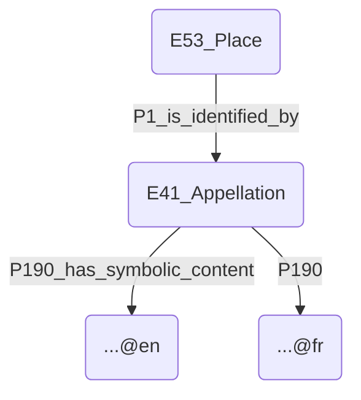
L'autre option aurait été de faire une double instanciation E41_Appellation et E33_Linguistic_Object pour spécifier la langue, mais ceci me semble complexifier inutilement le modèle
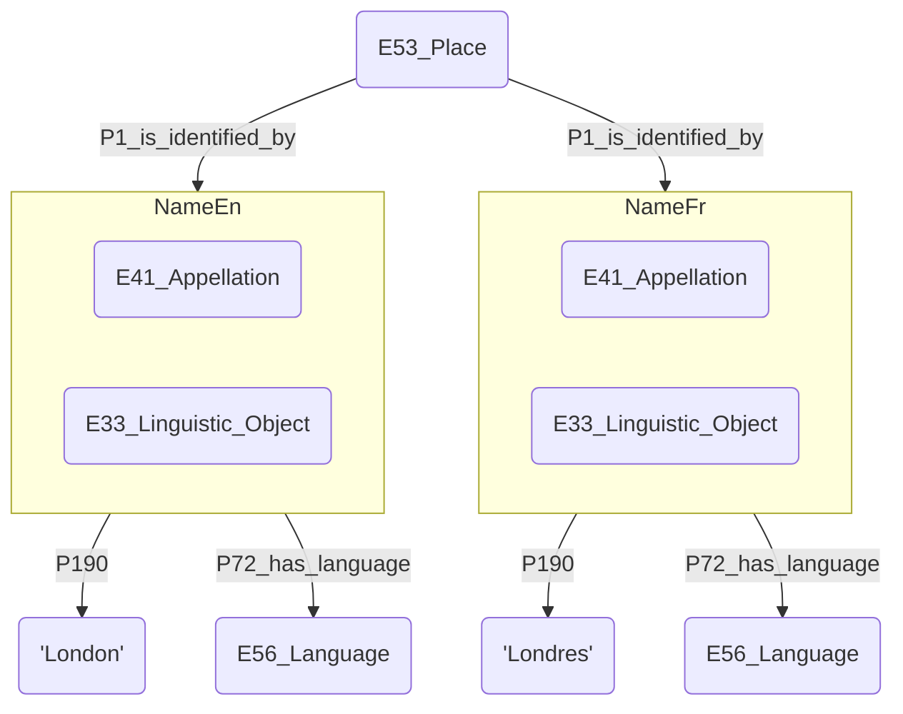

J'ai choisi de ne pas retenir les iso_code (BE pour Belgique) dans mon modèle.

### Artists
Beaucoup de types différents sur Getty correspondent à diverses variation d'artistes.
- http://vocab.getty.edu/aat/300025103 pour **artists (visual artists)**, si basart ne réfère que des œuvres visuelles. (Getty ID: 300025103)
- http://vocab.getty.edu/aat/300168455 pour **people in the arts**, si basart réfère également des œuvres non visuelles. (Getty ID: 300168455)
- http://vocab.getty.edu/aat/300168331 pour **people in the arts and related occupations**, si la table contient également les références d'autres agents (work owners, gallery owners, catalog editor, etc.)
- http://vocab.getty.edu/page/aat/300024979 pour **people (agent)**, peut-être le meilleur car le plus générique. Ce terme peut se prêter à tout artiste, mais également à n'importe quelle autre personne qui serait impliquée d'une autre manière dans les expositions recensées par BasArt.
Comme la table personage.csv regroupe de nombreux acteurs de nature très variées (et donc pas uniquement des artistes), j'ai choisi de ne lier à ces entités que le type **people (agent)**.

Dans la table artists.csv, le champ **gender_aat** donne l'URI des notions "male" et "female" sur Getty, qui sont répertoriés dans ce vocabulaire contrôlé comme des sous-classes de **sex (biological characteristic)**. Attention à ne pas confondre sexe et genre !
Pour modéliser cette information, je propose de retenir la structure proposée sur linked.art, mais d'utiliser le vocabulaire d'[homosaurus](https://homosaurus.org/v3) plutôt que celui de Getty pour définir le genre.
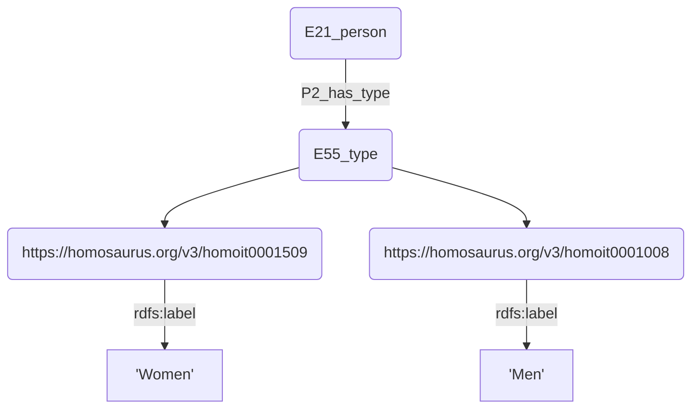

Pour le "membership", [[Bibliographie#SARI, 2020|SARI]] recommande d'utiliser
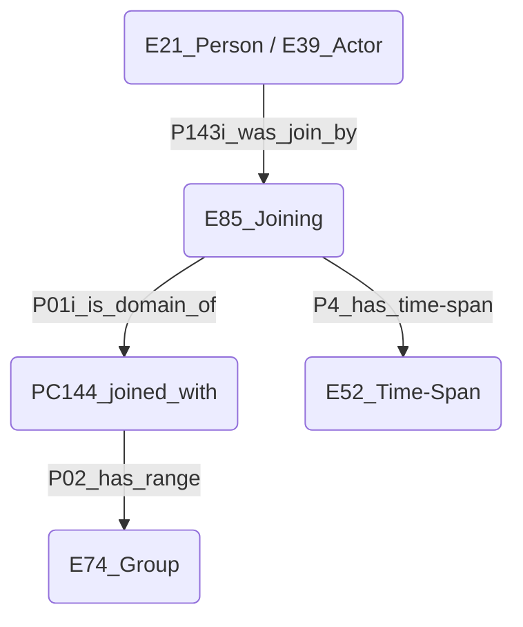
Mais la table Artists ne contient pas toutes ces infos, uniquement le nom du groupe affilié. J'ai donc choisi de procéder avec P107i, comme pour la nationalité.
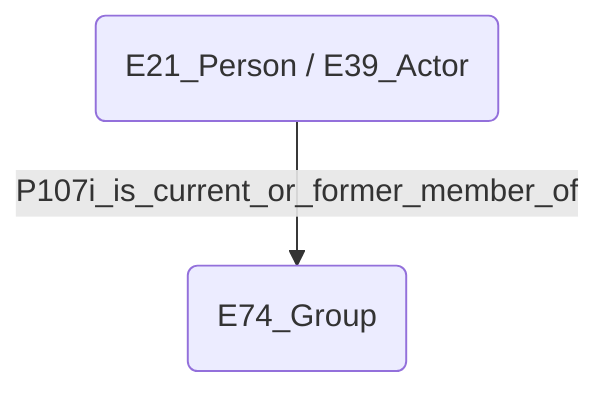

Pour le "instructor", SARI propose d'utiliser les relations P01 SRPC3 P02. Pour permettre une exploration simplifiée des données, il serait également intéressant de créer une nouvelle relation basart:has_advisor 
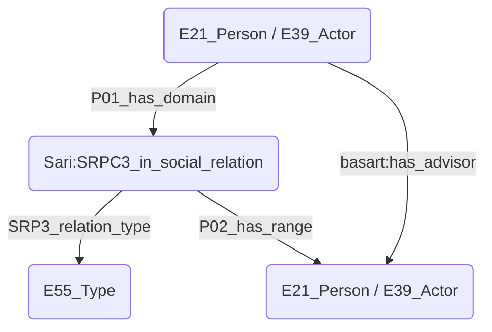

Les champs address1 et address2 de la table artists.csv sont relativement ambigus. Que signifie l'adresse d'un artiste mort il y a plusieurs dizaines d'années ? Il faudrait au moins que cette adresse soit liée à une date de validité.
Si ces champs désignent un endroit où l'artiste a vécu ou travaillé, l'unique moyen que j'ai trouvé pour le modéliser est de créer une "Activity Location" (person_127_activity_location)
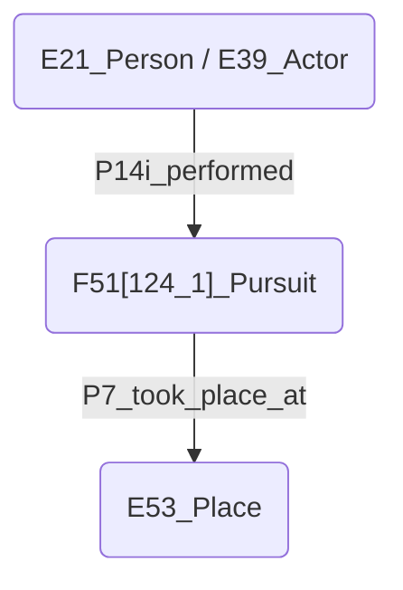

### Committee
Je ne sais pas du tout quelle classe donner aux personnes au sein d'un comité? Ni du type pour le comité lui-même ?

Les ressources RDF pour **l'appellation** du groupe et pour **les personnes au sein du groupe** sont toutes réunies dans un seul champ de la table committee.csv.

### Exhibited work
#### Langues
Dans la table csv, le champ **title** est doublé d'un champ **translation_title**, nous avons donc, pour certaines entrées, un titre en langue originale et sa traduction en français (à vérifier si ces traductions sont systématiquement en français). Pour ces champs équivalent, je propose donc d'utiliser une double instantiation en **E33_Linguistic_Object** et **E41_Appellation** pour spécifier la langue. Par contre, le champ **subtitle** n'est pas traduit (ou alors seulement dans le champs translation_title), je propose donc d'utiliser juste un **E41**.

#### Label de l'œuvre
Linked.art propose de mettre le type d'œuvre (lié à la technique utilisée), suivi de deux points, suivis du titre de l'œuvre -> "Painting: Pasture and Sheep". Ce choix permet de donner un maximum d'informations primordiale sur l'œuvre dès le label, mais il devient difficile à mettre en place quand les techniques sont nombreuses et variées pour une œuvre. Il devient peut-être aussi difficile de trouver une œuvre en la recherchant par son titre via le prédicat "label".
Si l'on se contente d'inscrire le titre de l'œuvre dans le label, cela simplifie énormément le mapping et peut-être également la lisibilité des résultats d'une requête. C'est le choix qui semble avoir été fait pour les quelques exemples actuellement (19.07.2022) présents dans BasArt.

#### Production
Linked.art et SARI proposent de lier l'œuvre à une production. Cet élément Production permet de lier l'œuvre à divers éléments, dont les informations sont recensées dans la table Exhibited Work :
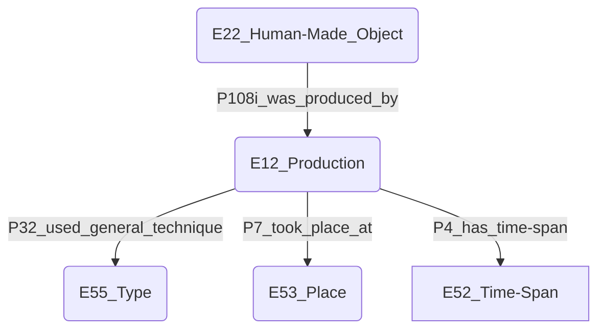
L'élément production devrait également être lié à d'autres éléments (surtout l'auteur!), dont les informations manquent dans la table Exhibited Work :
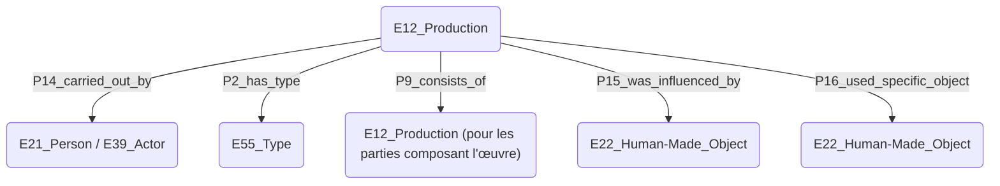
Le E55_Type sert ici à signaler des assertions sur l'activité en général, par exemple si elle fait part - en tant que contribution mineure ou majeure - d'une œuvre globale, ou pour indiquer si l'activité a été réalisée de manière égale ou non ([[Bibliographie#Linked art|Linked Art Contributors, 2018]]).
Au vu des données actuellement à disposition, seule l'indication de l'auteur semble être réellement essentielle. Les autres données manquantes peuvent peut-être être laissées de côté.

#### Production VS Type
Attention à ne pas confondre les deux! Getty a de nombreuses correspondances pour des œuvres de tous types, classées généralement sous **visual work** (e.g. "acrylic paintings (visual works)" <http://vocab.getty.edu/aat/300181918>), ainsi que pour leurs techniques de création, classés généralement sous **technique** ou **process** ("acrylic paintings (process)" <http://vocab.getty.edu/aat/300182574>).
Je me suis basé sur ce référentiel pour renommer ces données lors de la clusterisation.

#### Dimensions
SARI recommande de passer par une étape intermédiaire entre l'œuvre et ses dimensions (graph de gauche). Linked Art propose un chemin plus direct, plus adapté à l'utilisateur (graph de droite).
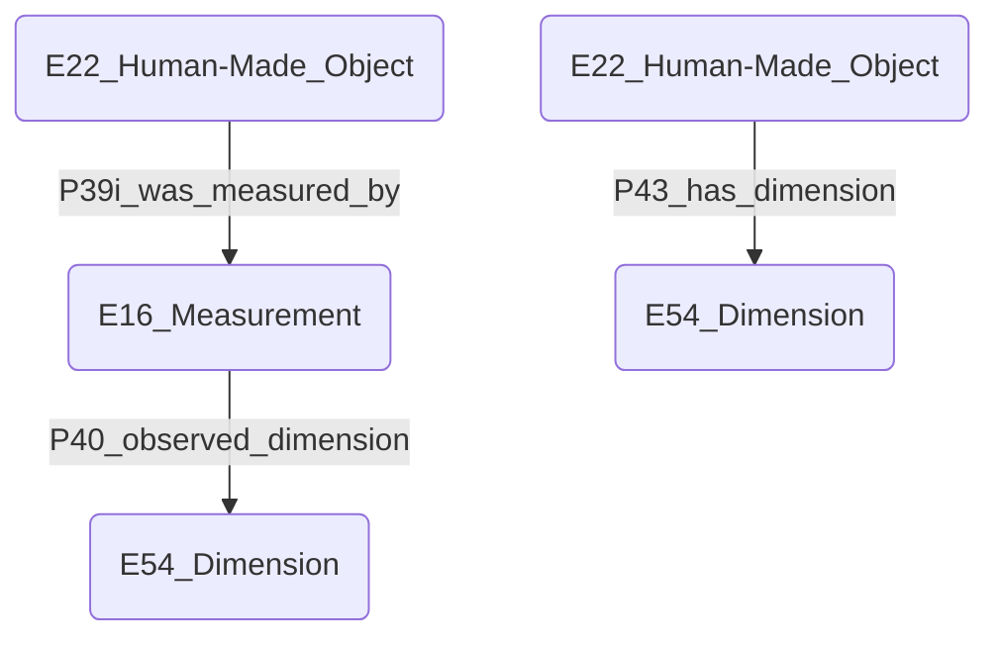
Cette seconde façon me semble plus simple à la foi à utiliser et à mapper.

#### Price
Linked Art ne propose que des solutions relativement compliquées pour mentionner le prix d'une œuvre. Le prix doit forcément passer par une E7_Activity de type [Getty - Provenance (history of ownership)](http://vocab.getty.edu/aat/300055863) 
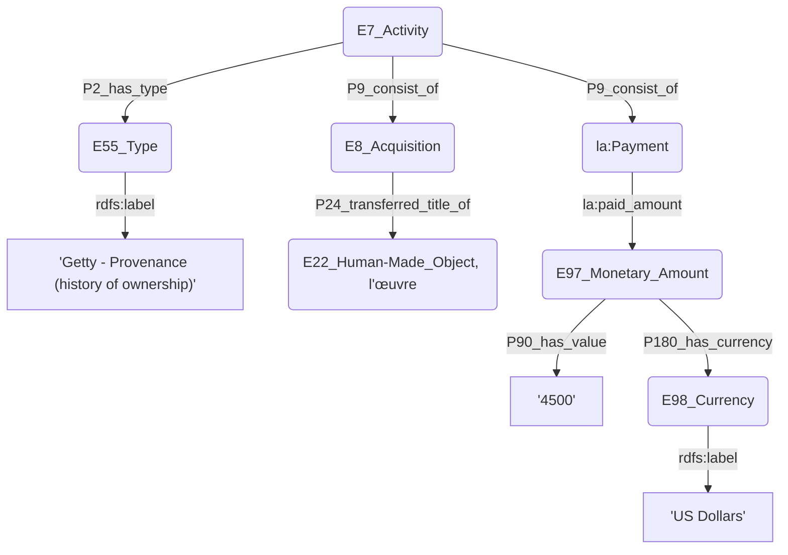
Au vu des données à disposition, on pourrait peut-être se contenter d'appliquer ce shéma
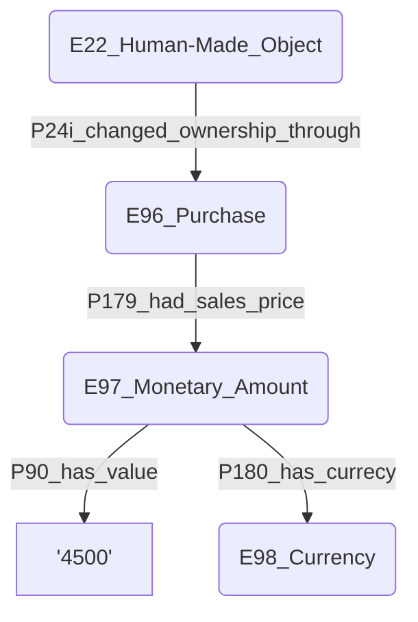
C'est beaucoup d'étapes, mais on évite de passer par une Auction dont on ne connaît pas l’existence, pour en détailler ensuite les lots, puis chaque pièce du lot, avant de pouvoir fixer un prix. Avec mon système, le prix est rattaché à l'œuvre en respectant les domain & range des propriétés CIDOC-CRM. Sinon, sans respecter ces caractéristiques de propriétés (le plus simple pour l'utilisateur au final) et de faire directement 
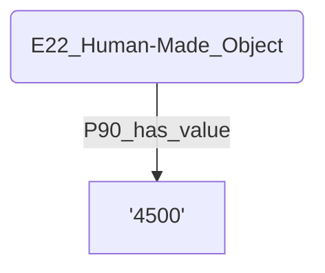
Mais cela ne respecte pas le domain de P90 (qui doit être un E54_Dimension, dont le E97_Monetary_Amount fait partie).

#### Exhibition
En RDF, le plus simple serait de modéliser les expositions qui utilisent les œuvres : E7_Activity -> P16_used_specific_object -> E22_Human-Made_Object.
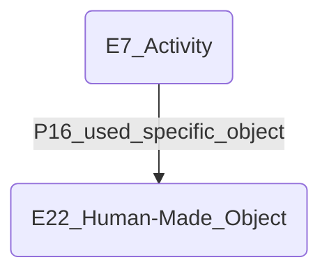
Linked Art propose de passer par un intermédiaire "set d'objet". L'avantage est de pouvoir récupérer le set complet d'une exposition à l'autre.

Comment modéliser correctement le déplacement d'une exposition, de manière à ce que les utilisateurs finaux accèdent simplement à cette information? Linked Art propose d'utiliser un E89_Propositional_Object pour représenter le "concept" de l'exposition, et d'y rattacher des E7_Activity qui sont les expositions en soi -> P17i_motivated -> E7_Activity qui représente les diverses activités d'exposer en soi (qui ont donc un E53_Place et un E52_Time-Span). Mais le P17i_motivated ne semble pas adapté, car il reflète un lien très spécifique entre l'œuvre et l'exposition, qui n'est peut-être pas correct. Il serait mieux d'utiliser P16i_was_used_for, qui est plus large et donc certainement plus correct.
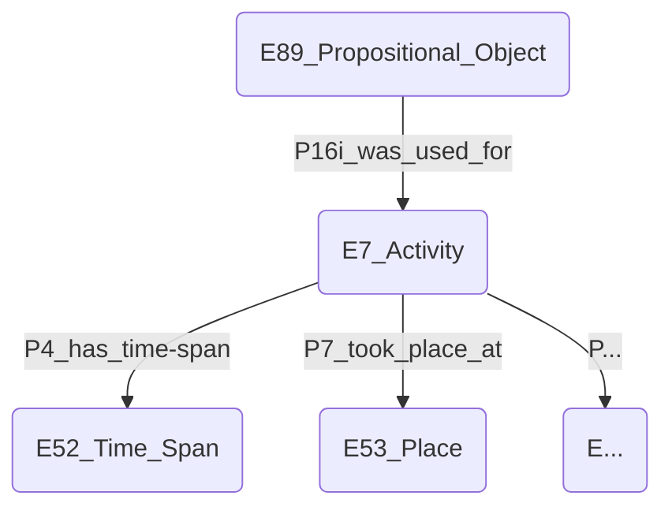


#### Owner
Linked Art spécifie que la possession d'un objet par un agent devrait être référencée comme ceci:
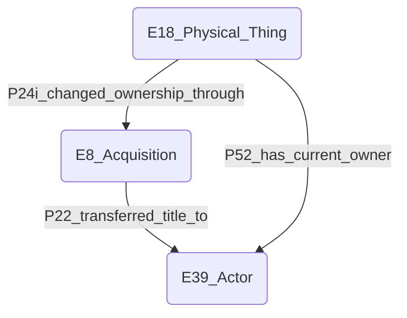
Pour donner toutes les informations et également simplifier le chemin pour ques les utilisateurs accèdent plus facilement aux informations.

À moins de vouloir spécifier que le "prix de l'œuvre" est intrinsèquement lié à cette transaction d'achat, on pourrait se contenter d'utiliser uniquement le chemin simplifié.

#### Reproduced in catalog
Dans la base csv, un champ **is_reproduced_in_catalog** indique seulement si l'œuvre est reproduite dans le catalogue par un t ou f. Cette information ne doit pas intéresser tellement les utilisateurs, qui préféreraient avoir un accès direct à cette image si elle existe. A-t-on des scans de ces images et peut-on imaginer de les introduire dans le triple store? Si oui, Linked Art propose le chemin logique suivant:
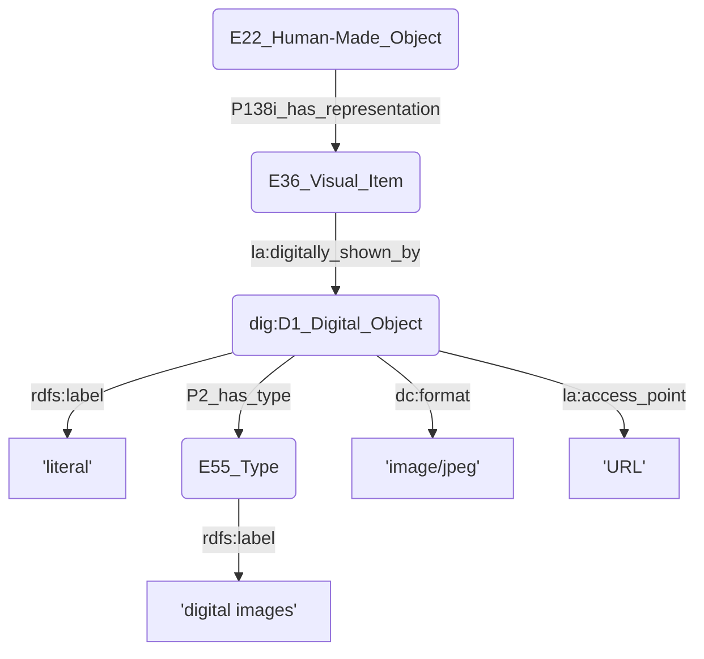
[Getty - digital images](http://vocab.getty.edu/aat/300215302)
Ce chemin pourrait servir à afficher directement les images des œuvres, rendre ces images accessible en RDF. Mais cela demande d'avoir les images isolée du scan général du catalogue, ça peut être long à mettre en place.
On peut aussi se contenter de donner l'information de la présence ou non d'une image de l'œuvre dans le catalogue (dont la source est mentionnée).

CHECK IF I CAN USE A BOOLEAN TO EXPRESS THAT WE ***KNOW THAT THERE IS NO INFO*** ABOUT THE IMAGE IN THE CATALOG.
Negative information is unsolved problem in RDF.
See if I can find a way to contourner cela. -> peut-être pointer sur une URI qui dit "il n'y a pas d'info" ?
Ça doit pas forcément être compris dans le langage de CIDOC CRM.
Voir si on veut utiliser du [[Outils#ERDF|ERDF]] ?
OU on peut créer des ressources comme: `[https://visualcontagions.unige.ch/resources/spec/image_in_cat]` 
`[https://visualcontagions.unige.ch/resources/spec/no_image_in_cat]`
Et lier les œuvres à cela par un E55_Type ?
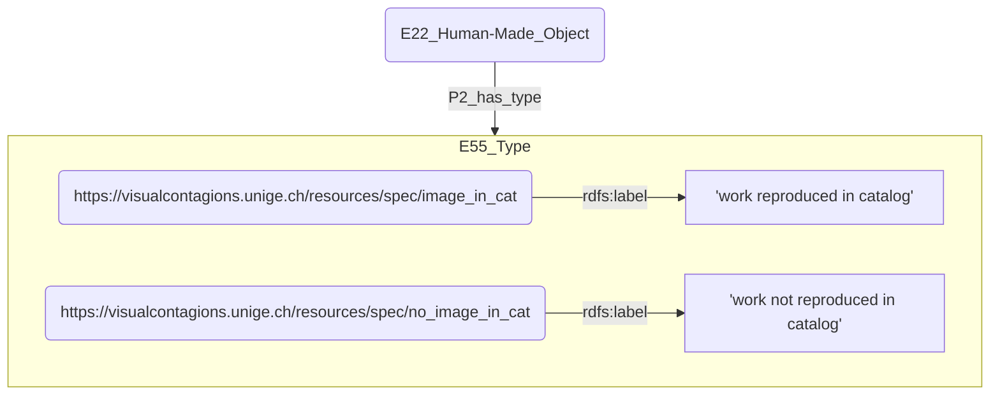

#### Artist - creator
Pour l'instant, le lien entre l'œuvre et son créateur passe par la production. Il faudrait peut-être créer un raccourci pour faciliter l'exploration des données par les utilisateurs?
```mermaid
graph TD
	a(E22_Human-Made_Object) -->|P108i_was_produced_by| b(E12_Production)
	b -->|P14_carried_out_by| c(E21_Person)
	a -->|???| c
```
Mais je n'ai pas trouvé de bonne solution...
Idées|Problèmes
-|-
P14_carried_out_by|Domain : Activity
P94i_was_created_by|Domain : Creation
P108i_was_produced_by|Domain : Production
Je n'ai trouvé aucune propriété qui puisse directement lier une œuvre à son auteur. Peut-être faudrait-il en créer une ?

#### Room, work number and catalog chapter
Je ne sais pas comment rattacher ces deux informations à l'œuvre.
**Room** indique l'emplacement de l'œuvre au sein de l'exposition. Cette information est très spécifique, est-elle utile pour notre modèle ?
**Number** doit désigner - je suppose - le numéro de l'œuvre au sein de l'exposition. Est-il possible de modéliser un E42_Identifier n'ayant lieu que dans un contexte donné, celui de l'exposition ? On peut tout à fait envisager qu'une même œuvre exposée dans différentes expositions y ait eu des numéros différents.
**Catalog chapter** indique la partie du catalogue dans laquelle on trouve un article ou une mention de l'œuvre. Mais comme aucun lien direct n'est établi depuis l'œuvre jusqu'au catalogue, je ne sais pas comment récupérer cette information.

### Catalog
Pour lier une langue à un catalogue, il faut que ce dernier soit instancié comme un **E33_Linguistic_Object**. 

Pour refléter sa nature de documentation aux sujet d'une exposition, il faut également l'instancier comme un **E31_Document**. C'est le meilleur choix, car il s'agit de l'élément-type pour documenter un autre élément.
(On évitera **E73_Information_Object** car "Instances of E73 Information Object of a documentary nature should be declared as instances of the E31 Document subclass." [[Bibliographie#CIDOC CRM SIG 2014|CIDOC CRM SIG, 2014]].) Pour lier le catalogue à l'instance qu'il documente, on peut soit utiliser **P70_documents** qui indique que le document fait une proposition sur la réalité, soit **P129_is_about** qui indique que le document a pour sujet l'instance désignée. On évitera **P67_refers_to**, car il indique que le document a comme sujet _principal_ l'instance visée.

Comme le catalogue a une information de langue, il ne me paraît pas utile de spécifier la langue de son titre. Le titre est donc un **E41_Appellation**, sans E33_Linguistic_Object.

```mermaid
flowchart TD
	subgraph Catalog
		a(E31_Document)
		b(E33_Linguistic_Object)
	end
	Catalog -->|P72_has_language| c(E56_Language)
	Catalog -->|P129_is_about / P70_documents| d(E7_Activity)
	Catalog -->|P1_is_identified_by| e(E41_Appellation)
```


Le contenu du champ **source** est problématique: URL, ISBN, références à des archives, contenus plus vagues comme "Maus" (id 2576) ou "Chronique des arts et de la curiosité - Rubrique "Concours et expositions"" (id 1562).
Pour le modéliser, on peut soit passer uniquement par le raccourcis **P67i_is_referred_to_by**, soit par l'intermédiaire du **PC67_Refers_To**. L'intermédiaire, plus long, permet de compter le nombre de sources de notre graph. Le raccourcis permet de mieux lier les données pour faciliter leur exploration.
The complete model may be better for our context, cause it offers more possibilities of analysis and exploring data -> more useful for a university and global research ?

```mermaid
flowchart TD
	subgraph Catalog
		a(E31_Document)
		b(E33_Linguistic_Object)
	end
	c(PC67_Refers_To) -->|P02_has_range| Catalog
	c -->|P01_has_domain| d(E73_Information_Object)
	Catalog -->|P67i_is_referred_to_by| d
```


### Exhibition
#### Traveling
une donnée True or False, difficile à modéliser en RDF, car pas de moyen d'exprimer une information négative. On peut adopter a même solution que pour indiquer si les œuvres sont reproduites ou non dans le catalogue, c'est-à-dire qu'on peut créer des ressources correspondant à ces deux états: `<https://visualcontagions.unige.ch/resources/spec/traveling_exhibition>`
`<https://visualcontagions.unige.ch/resources/spec/non-traveling_exhibition>`
et les considérer comme un E55_Type
```mermaid
flowchart TD
	a(E1_Activity) -->|P2_has_type| E55_Type_travel
	subgraph E55_Type_travel
		b(http://vocab.getty.edu/aat/300054773)
		c(https://visualcontagions.unige.ch/resources/spec/non-traveling_exhibition)
	end
	b -->|rdfs:label| d['traveling exhibitions']
	c -->|rdfs:label| e['non-traveling exhibitions']
```

#### Public
Donnée True or False, on peut la modéliser en E55_Type, mais sans créer de ressource. On peut utiliser les ressources Getty aat:
`public (general concept): <http://vocab.getty.edu/aat/300444972>` et
`private (general concept) : <http://vocab.getty.edu/aat/300444973>

```mermaid
flowchart TD
	a(E1_Activity) -->|P2_has_type| E55_Type_public
	subgraph E55_Type_public
		b[http://vocab.getty.edu/aat/300444972]
		c[http://vocab.getty.edu/aat/300444973]
	end
	b -->|rdfs:label| d["'public (general concept)'"]
	c -->|rdfs:label| e["'private (general concept)'"]
```

### Exhibition Group
Les groupes peuvent être de type différents, indiqué par le champ id_type. Il faut donc modéliser des E55_Type en fonction de ces données pour chaque groupe.
Ce champ fait référence à la table exhibition_group_type.csv. Les entrées proposées ne sont pas référencées dans Getty AAT (Simple exhibition, Salon, Other, Secession, Society, Festival, Universal exhibition, Artists' group, Women artists' exhibition, Biennial / Triennials / Documenta).
Les AAT
ID|Type FR|Type EN|AAT
-|-|-|-
1|Exposition simple|Simple exhibition|[exhibitions (events)](http://vocab.getty.edu/aat/300054766)
2|Biennales / Triennales / Documenta|Biennial / Triennials / Documenta|[biennials (exhibitions)](http://vocab.getty.edu/aat/300266309)
3|Salon|Salon|[fairs](http://vocab.getty.edu/aat/300054776), [halls of fame](http://vocab.getty.edu/aat/300005813)
4|Autre|Other|-
5|Sécession|Secession| ???
6|Société|Society|[societies (associations)](http://vocab.getty.edu/aat/300026009)
7|Festival|Festival|[festivals (celebrations)](http://vocab.getty.edu/aat/300073472), [art festivals](http://vocab.getty.edu/aat/300386366)
8|Exposition universelle|Universal Exhibition|[world's fairs (exhibitions)](http://vocab.getty.edu/aat/300054778)
9|Groupe d'artistes|Artists' Group|[artist groups](http://vocab.getty.edu/aat/300435209), [art initiatives (groups)](http://vocab.getty.edu/aat/300443860), [artist associations](http://vocab.getty.edu/aat/300435210), [artists' collectives](http://vocab.getty.edu/aat/300265433), [arts associations](http://vocab.getty.edu/aat/300386369), [art unions](http://vocab.getty.edu/aat/300183077)
10|Exposition d'artistes femmes|Women Artists' Exhibition| ???
Il n'y a aucune entrée du type 4 "Autre / Other", donc pas besoin de trouver un équivalent Getty pour celui-là.

### Catalog article
Pour modéliser la langue, il faut accepter une cardinalité multiple (1-n), car certains articles sont bilingues.

Très peu d'auteurs·trices ont un ID qui les référence dans la table personage.csv. Celles et ceux qui n'ont pas de référence ne sont indiqués que par un nom.

### Exhibition section
Difficile de saisir s'il s'agit d'un **lieu**, d'une partie d'un **catalogue** ou d'une partie d'un **événement**. J'ai choisi de le comprendre comme partie d'un événement, soit un **E7_Activity**.

Les lieux auxquels se réfèrent ces sections sont modélisés comme ceci
```mermaid
graph TD
	A(E7_Activity) -->|P7_took_place_at| B(E53_Place)
	B -->|P2_has_type| D(Space type table)
	D --> E(E55_Type)
	B --> C(Address schema and table)
```
Mais il reste difficile de saisir si ces **space types** sont des **lieux** ou des types d'**associations**.

Difficile de trouver une propriété pour lier l'**exhibition section** à l'**exhibition** générale. Peut-être **P9i_forms_part_of** ?
```mermaid
graph TD
	A("E7_Activity (exhibition section)") -->|P9i_forms_part_of| B("E7_Activity (exhibition)")
```


## CIDOC-CRM
### Questions générales
On utilise rdfs:label pour lier une _top entity_ (actor, place, work...) à son nom. On utilise P190_has_symbolic_content pour lier un E41_Appellation ou un E42_Identifier à leur contenu, qui est le nom de la _top entity_, mais pas le nom de l'Appellation ou de l'Identifier.
```mermaid
graph TD
	a(E39_Actor) -->|P1_is_identified_by| b(E41_Appellation)
	b -->|P190_has_symbolic_content| c['Basquiat, Jean-Michel']
	a -->|rdfs:label| c
```


