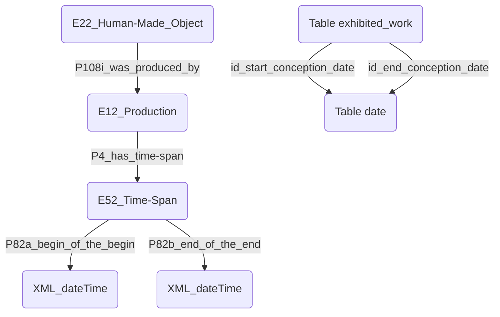
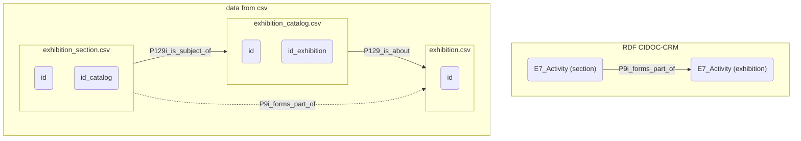

# Modifications nécessaires sur les données
## Works
### Category et Medium
Ces deux champs présentaient de nombreuses informations réunies au sein de cellules uniques. Pour les utiliser correctement, il a fallu créer 2 nouvelles tables contenant uniquement : 1) le **work_id** et la **category**; 2) le **work_id** et le **medium**.
Pour chacune de ces tables, il a fallu décomposer chaque entrée dont le champ category ou medium contenait plusieurs informations en plusieurs entrées, présentant toutes le même work_id et une seule information lié à la category ou au medium. Par la suite, il a également fallu clusteriser ces informations.
Elles font donc chacune maintenant l'objet d'un mapping qui leur est propre, séparé du mapping des autres informations relatives aux works.

### Artist
Il a fallu ajouter le personage_id, l'auteur de chaque œuvre, à la table works, en passant pas la table has_exhibited_in

### Date
Pour les dates de création, à gauche le modèle CRM, à droite nos data

Les données des champs `id_start_conception_date` et `id_end_conception_date` ne suffisent pas pour créer une entité E52_Time-Span.
Il a fallu utiliser ces données pour récupérer directement les données sous forme de dates (et non pas d'ID) au sein de la table. Car en CIDOC-CRM, ce sont les Time-Span qui sont représentés par un nœud, et les 2 dates auxquelles ils font référence ne sont exprimées que sous la forme de données xls:dateTime, soit des literals et non des nœuds.
Il fallait donc disposer des deux dates au sein même de la table pour pouvoir les affilier à une instance de Time-Span, en ne créant de nœud que pour cette instance de Time-Span.

### Catalog
Il a fallu ajouter le id_catalog à la table work pour en mapper correctement le lien, en passant par les tables has_exhibited_in et exhibition_section.

### Exhibition
Il a fallu ajouter les id_exhibition dans lesquelles les œuvres ont été recensées à la table work, en passant par la table exhibition_catalog.

## Exhibition
### Dates
Il a fallu y ajouter les dates. Celles-ci étaient déjà là, mais ne présentaient que l'année. Pour gagner en précision, il a fallu rechercher les dates précises en passant par la table exhibition_catalog.

## Catalog
### Committee
il a fallu ajouter les id_committee à la table exhibition_catalog, en passant par le table exhibition_section_has_committee

### Language
Plusieurs informations étaient parfois contenues dans cette colonne. Il a fallu créer une nouvelle table cat_language contenant uniquement le catalog_id et les languages, puis décomposer les entrées contenants plusieurs langues en plusieurs entrées contenant une seule langue chacune.
Elle fait maintenant l'objet d'un mapping qui lui est propre, indépendant du mapping général dédié aux catalogues.

## Section
### Exhibition
Il a fallu ajouter les id_exhibitions en passant par la table exhibition_catalog :

### Committee
Il a fallu ajouter les id_committee en passant par la table exhibition_section_has_committee.

## Committee
### Committee type
Il a fallu ajouter directement le nom en fr et en en des committee type pour les mapper en tant que literals.

## Person
### Birth and death dates
Il a fallu ajouter les birth et death dates à la base, pour ne générer qu'un nœud correspondant à un time-span, au lieu de 2 nœuds correspondant à des dates.

## Address
Comme nous avons fait le choix de ne retenir que 3 nœuds pour modéliser les adresses (address, city, nation), il a fallu ajouter l'id_nation à la table city.csv, en passant par la table state.csv