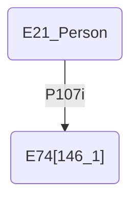
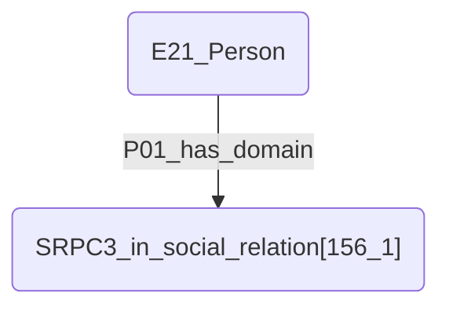

# Outils
## Open Refine
C'est notamment pour faire des wkt à partir des longitudes et latitudes.
Je sais pas l'utiliser.
Où le trouver?
Est-ce qu'il faut l'installer ou full on-line?
Quelle tête ça a un wkt?

## SARI Documentation
Dans l'exemple **person_146_cultural_affiliation**, qu'est-ce que ça veut dire le 146_1 ?

Dans l'exemple **person_156_relation**, d'où vient le P01? de CIDOC-CRM? je n'ai trouvé aucune info sur les P0. Et d'où vient le SRPC3 ? D'un autre référentiel ?

## ERDF
Extended RDF, permet l'expression de weak and strong negations, qui pourraient être utiles pour exprimer l'absence de reproduction d'une œuvre dans un catalogue, par exemple.

