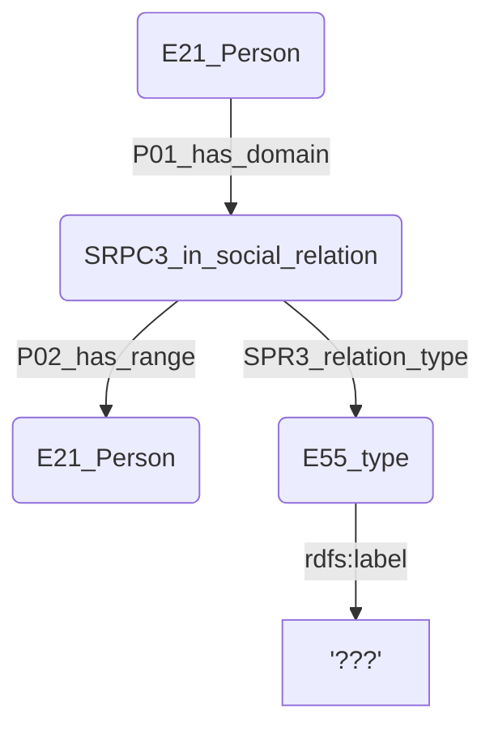

# Problèmes des Tables
## Table Personages

### Doublons des données
Plusieurs personages sont indiqués à double (ou plus) sous différents ID, mais avec à peu près les mêmes informations à chaque fois. Par exemple Pierre-Auguste Renoir 

### Champs vides
**notes**, **source**, **id_person**, **id_user_artist** sont des champs vides.

### Champs problématiques
Les champs **address1 et address2** (et leurs ID respectifs). Qu'est-ce que ça signifie ? L'endroit où vit / a vécu l'artiste? L'endroit où il a travaillé?

### Données problématiques
Certaines entrées de la table ne désignent pas un artiste, mais un groupe d'artistes. Ça risque d'être problématique pour modéliser ça en RDF.
On peut choisir de désigner les entrées de cette table comme des E39_Actor.
On peut aussi choisir de transformer ces entrées de groupe en n entrées séparées, et de leur créer un lien entre elles. Mais quel lien? peut-être:

Les données sur le genre indiquent généralement F ou M. Mais certaines indique FM, pour désigner des groupes de personnes, ou parfois des personnes uniques avec un prénom mixte (Claude, Dominique), un prénom ambigu (Germaine-Marcel) ou un prénom extra-européen (Jo, Lo, Toty, Lan). Pour l'instant je n'ai rien modélisé pour ces entrées, me contentant de spécifier les entrées de femmes et d'hommes en les liant à un E55_Type avec l'URL correspondant sur homosorus: <https://homosaurus.org/v3/homoit0001509>, 
<https://homosaurus.org/v3/homoit0001008>

## Table Address
Il manque peut-être un NPA?

## Table Cities
### Doublons des champs
**wikidata_id** et **wd_identifier** semblent indiquer une fonction identique. **wd_identifier** est vide.

### Problèmes de données
###### ID
Certaines entrées sont à double ou plus, comme La Varenne-Saint-Hilaire (wikidata_id : Q193313) :
- Plusieurs villes ont des noms différents, mais partagent les mêmes identifiant et nom sur wikidata. Par ex: La Varenne-Saint-Hilaire, Parc-Saint-Maur, Saint Fossés, Saint-Maur-des-Fossés sont tous indiqués comme Q193313 Saint-Maur-des-Fossés sur wikidata.
- Plusieurs villes apparaissent à double car leur nom n'a pas de graphie d'authorité. Par exemple: Parc-Saint-Maur, Le Parc-Saint-Maur, Le Parc Maur, Le Parc-St-Maur

###### id_state
Toutes les villes du Brézil indiquent **id_state 296**, alors que cet ID n'existe pas dans la table **country.csv**. Le Brézil correspond en fait à l'entrée **206**. Je ne sais pas si d'autres erreurs de ce type ce sont glissées dans ces données.

### Champs que je sais pas quoi en faire
**Notes**, **id_state**, **source_geoloc**.

## Table Committee
id_type -> person_type
### Problèmes des données
Beaucoup de personnes ou de groupes sont signalées de nombreuses fois, avec un ID différent à chaque fois.

Un seul champ regroupe parfois une personnes, parfois plusieurs personnes, parfois le nom d'une association.

## Table Exhibited work
### Problèmes des données
###### Medium
le champ **medium** présente trop d'irrégularités. La plupart donne des indications sur la technique utilisée pour réaliser l'œuvre, mais d'autres indiquent un matériau utilisé plutôt qu'une technique.
Lors de la clusterisation des données, pour la plupart des entrées, j'ai trouvé la technique ou le matériau correspondant sur getty AAT. Lorsque cela était possible, j'ai toujours choisi de favoriser la technique sur le matériau (ex: "Bois" est devenu "woodworking" plutôt que "wood")
Les plus problématiques sont les suivants, et voici comment j'ai choisi de les incorporer :
Données du CVS|Données pour le RDF|Commentaire
-|-|-
Ágata|Ágata|Il y a beaucoup d'entrées très différentes contenant le terme Agata, je n'ai pas su choisir
Polyester|polyester|il y a 2 entrées différentes sur AAT: polyester (resin) et polyester(fiber). J'ai choisi de n'indiquer que "polyester"
Na ou N.R.||J'ai choisi de laisser la case vide, pour NE PAS CRÉER D'ENTITÉ RDF, plutôt que de créer un triplet vers un genre de N.A.
Pintura Moderna|Modern painting|J'ai trouvé "painting" et "Modern" sur AAT
Bronze comp.|bronze comp.|Je n'ai trouvé que "bronze" sur AAT
Óleo Sobre Cartão|Óleo sobre cartão|J'ai eu de la peine à définir le sens de "cartão". Carte postale? carte à jouer? J'ai laissé tel quel
Film|Film|Je n'ai pas trouvé "film" sur AAT, je l'ai laissé tel quel
Dessin aquarellé|drawing + watercolor painting|J'ai combiné les deux éléments trouvés sur AAT
Bois Polychromé Et Ajouré|color woodcut + wood openwork|J'ai combiné "color woodcut" qui correspond au "bois polychromé" et "wood openwork" qui correspond à "bois ajouré"
Oleo sobre Pavatex|oil painting on plywood|Pavatex est une entreprise spécialisée dans le bois de coffrage, pour couler le ciment. J'ai supposé qu'il s'agissait donc de bois compensé
Plaka|plaka|Plaka est une entreprise spécialisée dans les accessoires pour techniques de chantier. J'ai hésité à utiliser "plywood" ou "formwork". Dans le doute j'ai choisi de laisser "plaka".
Gehönter Gyps|Gehönter Gyps|Je n'ai rien trouvé qui correspond sur AAT. Bcp de types de "gypsum" sont présents, mais je ne sais pas duquel il s'agit.
Fer oxydé|iron oxide red|J'ai choisi d'interpréter ce "fer oxydé" comme le pigment rouge qui lui correspond, unique entrée sur AAT qui s'approche de ce concept
Óleo Sobre Duratex|oil painting on Duratex|Je n'ai pas compris quel type de support est Duratex
Duco Sobre Masonite|Duco on Masonite|Je n'ai pas trouvé "duco"
Oleo Sobre Masenite|oil painting on Masonite|Je n'ai pas trouvé "Masenite", je suppose que c'est une erreur, qu'il doit s'agir de "Masonite"
Auto Lithograph|Auto Lithograph|Pas trouvé sur AAT
Vinavil|glue|Semble être une fameuse marque de colle
Aguada|Aguada|Trop d'options différentes sur getty...

Pour les entrées contenant un "et" ou "e" ou "and", j'ai remplacé cet élément par une virgule, afin de pouvoir à nouveau splitter la colonne et procéder à une autre clusterisation.
Pour les entrées spécifiant la technique et le support, j'ai cherché les noms correspondant à la technique ainsi qu'au support sur Getty AAT, et les ai combiné avec "on" (ex: "oil painting on canvas")

###### Category
le champ **category** présente les mêmes problèmes que le champ **medium**.
Données du CVS|Données pour le RDF|Commentaire
-|-|-
etc.||J'ai choisi d'enlever simplement ces données, car le contenu informatif est nul.
pièce|pièce|j'ai laissé tel quel cette catégorie, car on manque d'information pour savoir de quoi il s'agit (pièce d'un bâtiment? de monnaie? partie d'un mécanisme?)
panneau, panneaux décoratifs, pannello|panel paintings|j'ai choisi de tout mettre sous panel paintings car c'est ce qui me semblai le plus plausible
ovale|ovale|je l'ai laissé tel quel par manque d'information
objet technique, ~ américains, ~ mathématiques|tels quels|je les ai laissés tels quels, par manque d'information
reprodução em off-set|reprodução em off-set|trop de "offset" différent sur AAT
tableau mural|tableau mural|trop de "tableau" sur AAT

###### Time-Span
les time-span sont donnés sous la forme des deux identifiants **id_start_conception_date** et **id_end_conception_date**, dont je ne sais pas à quoi ils correspondent.

###### Dimensions
Les dimensions sont regroupées dans un seul champ **size**, parfois au format 18x54, parfois au format 18 x 54 cm (avec les espace autour du "x" et la mention "cm").
Les nombres décimaux sont notés avec une virgule "," et non pas un point "."
Parfois, plusieurs œuvres regroupées en une seule entrée (par ex: id 104638, "Trois croquis : femme nue debout, deux femmes nues, femme nue"). Les dimension des trois œuvres sont au format 17x10, chacune séparées des autres parfois par une virgule, parfois par un " ; " et par un " et ".

Certaines entrées présentent les dimensions des œuvres au format "d22" ou "h27", il semblerait qu'il s'agisse de pièces à forme ronde, d ou h signifiant le diamètre ou la "hauteur" du cercle.

Ce champ va nécessiter beaucoup de travail de nettoyage et il sera difficile de déterminer automatiquement quand les mesures correspondent à une hauteur, une largeur ou un diamètre.

###### Doublons
Certaines œuvres sont présentes à plusieurs exemplaire, comme les trois croquis de femmes nues réunis en une seule entrée (id 104724 et 104638).

### Price
Les contenus du champ **price** varient pas mal. La monnaie n'est jamais indiquée, ni l'époque à laquelle cette valeur à été fixée, ni par qui, ni dans quel but. Je ne sais pas trop ce que l'on peut faire de ces informations.

### Exhibition
pour l'instant, le champ **id_has_exhibited_in** contient systématiquement exactement 1 id. Donc, selon cette base, chaque œuvre n'apparaît exactement que dans une seule exposition. Ceci explique peut-être la présence de doublons concernant les œuvres. Cette table recense moins des œuvres exposées que les occurrences d'œuvres au sein d'une exposition.

### Champs que je sais pas quoi en faire
**number**, **notes**, **id_user**, **timestamp**, **category**, **catalog_chapter**.

## Table Exhibition Catalog
### Champs que je sais pas quoi en faire
**notes**, **id_user**

## Table Exhibition
### Champs que je sais pas quoi en faire
**id_user**, **timestamp**, **former_country**, **former_city**

### Données à améliorer
La **table exhibition** contient les champs **begin_year** et **end_year** qui indiquent les années de début et de fin des expositions. Mais la **table exhibition_catalog**, qui est liée aux expositions par son champ exhibition_id, contient les champs **id_begin_date** et **id-end_date**, qui renvoient à la **table date**, qui contient des informations plus précises sur ces dates de début et de fin. Il vaut donc mieux, si possible, passer par cet intermédiaire, qui indique également le jour et le mois.

## Table Exhibition Group
### Champ titleen
Ce champ ne contient que 5 entrées, dont le contenu est identique au champ titlefr. On peut donc l'ignorer.

## Table Catalog article
### Champ language
Il faut réconcilier les données ("Fraçais", "française").

### Champs que je sais pas quoi en faire
**comment**

## Table Exhibition section
### Champs que je sais pas quoi en faire
**notes**.

## Table ext geoloc req
Il me semble que cette table ne rassemble que des commentaires sur les recherches d'adresses effectuées par les membres de BasArt. Je ne l'ai pas pris en compte.

## Table is_partnair
Cette table ne contient aucune donnée, je l'ai ignorée.

## Table picture
Cette table ne contient aucune donnée, je l'ai ignorée.

## Table Session
Cette table semble ne contenir que des métadonnées sur l'utilisation de la base de donnée par les membres de BasArt. Je l'ai donc ignorée car il ne semble pas y avoir d'intérêt à modéliser ces données en RDF.